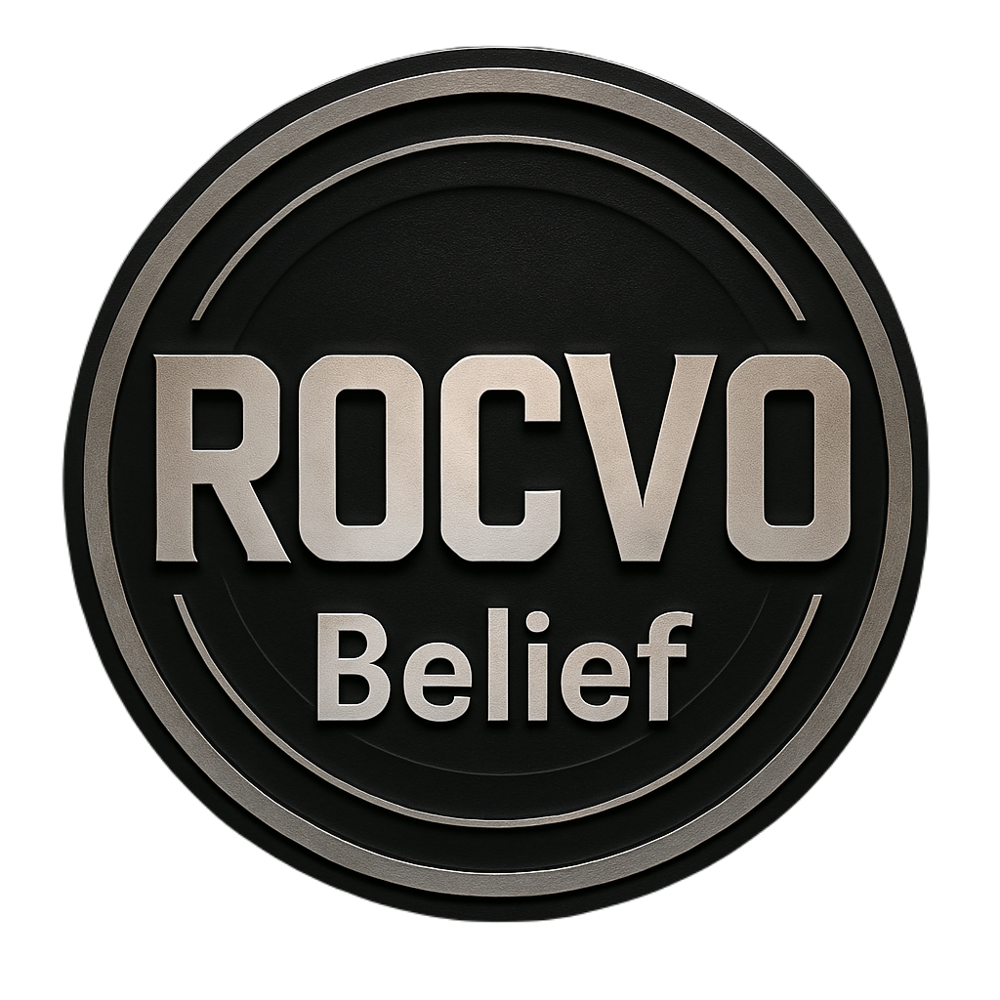

# rocv0-Belief

# rocv0-Belief – Site creștin cu resurse biblice și meditații spirituale

**rocv0-Beliefe** este un site creștin dedicat promovării valorilor biblice, rugăciunii și înțelegerii cuvântului lui Dumnezeu. Platforma oferă articole spirituale, versete zilnice și ghiduri pentru aprofundarea relației personale cu Hristos.

🌐 Site live: [https://rocv0-belief.github.io/rocv0-Belief/](https://rocv0-belief.github.io/rocv0-Belief/)

---

## ✝️ Ce vei găsi pe site

- Articole creștine despre rugăciune, iertare, pace, smerenie
- Versetul zilei din Biblie
- Resurse pentru devoționale personale
- Rugăciuni pentru situații speciale
- Citate motivaționale creștine

---

## 🎯 Misiunea proiectului

> „Să-L cunoască pe Dumnezeu cât mai mulți oameni și să trăiască o viață ancorată în credință, iubire și adevăr.”

Scopul nostru este de a încuraja cititorii să își întărească viața spirituală prin lectură, meditație și rugăciune.

---

## 🧭 Navigare pe site

- **[Acasa](./index.html)** – continutul site-ului
- **[Canal Youtube](./canalYoutube.html)** – canalul Youtube
- **[Despre](./despre.html)** – viziune, valori
- **[Versete](./versete.html)** – versete,citate biblice
- **[Viata sfintilor](./viataSfintilor.html)** – despre sfinti
- **[Contact](./contacte.html)** – email

---

## 📸 Captură de ecran



---

## 🔍 Optimizare SEO

- Marcu 12:31
- rocv0-Belief este o platformă educațională crestina
- [Linkuri interne și sitemap pentru indexare](https://rocv0-belief.github.io/rocv0-Belief/index.html)

---

## 🚀 Cum rulezi local

```bash
git clone https://github.com/rocv0-belief/rocv0-Belief.git
cd rocv0-Belief
